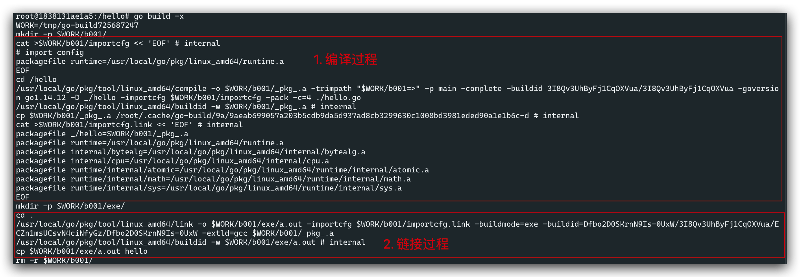

## 理解可执行文件编译过程

Go 的编译过程为: go 源码(\*.go 文件) -> 编译 -> 链接 -> 可执行文件

观察这个过程:

```sh
> make run && cd /hello
> go build -x
```



`go build`首先会将`*.go`文件编译成目标代码, 即`*.a`文件, 这一步就是**编译**(个人觉得叫翻译更好理解).

这时形成`*.a`还不能运行, 还需要将程序依赖其他代码与其合成在一起. 这一步叫做*链接*. 链接后的文件就时我们需要的*可执行文件*.

## Go 编译过程分析

这里先学一个编译命令:

```sh
> go tool compile -S hello.go
# 可以使用 go doc cmd/compile 命令查阅命令参数
# -S 打印汇编代码
# -S -S 打印汇编代码及数据
```

我们这里可以看到的是编译最后形成的汇编代码.

对于 Go 的编译过程大概可以分 4 个阶段: 词法和语法分析, 类型检查和 AST 转换, 通用 SSA 生成, 机器代码的生成.

我们刚才看到的就是最后一个步骤.
